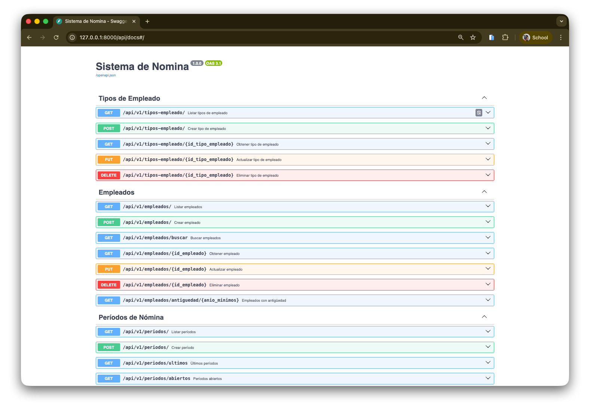

# Sistema de Nómina (Proyecto - Fines Académicos)

Este repositorio contiene un sistema de nómina desarrollado en Python con FastAPI. El propósito del proyecto es académico: servir como ejemplo didáctico de diseño de API REST, cálculo de nómina y organización de un proyecto web con buenas prácticas.

---

## Tecnologías y dependencias

- Python 3.10+ (recomendado)
- FastAPI (framework web)
- Uvicorn (servidor ASGI)
- SQLAlchemy (ORM)
- PyMySQL (driver MySQL)
- Pydantic / pydantic-settings (validación de modelos y configuración)
- Alembic (migraciones)

Las dependencias están listadas en `requirements.txt`.

---

## Estructura principal del proyecto

Carpeta principal relevante:

- `app/` - Código de la aplicación
  - `app/main.py` - Punto de entrada (configura FastAPI, middlewares y routers)
  - `app/api/endpoints/` - Routers por recurso (empleados, tipos_empleado, periodos, nomina)
  - `app/core/config.py` - Configuración central (host, puerto, base de datos, CORS, .env)
  - `app/db/` - Inicialización de sesión y base de datos
  - `app/services/` - Lógica de negocio (cálculo de nómina, servicios de entidades)
  - `app/repositories/` - Acceso a datos
  - `app/models/` - Modelos ORM
  - `app/schemas/` - Esquemas Pydantic (request/response)

Otros archivos:

- `requirements.txt` - dependencias
- `scripts/init_local_db.py` - script auxiliar para inicializar la DB local (si aplica)

---

## Requisitos para ejecutar localmente

1. Tener Python 3.10+ instalado.
2. Tener MySQL (u otro servidor compatible) configurado si desea usar la configuración por defecto.
   - Por defecto la configuración en desarrollo está en `app/core/config.py`: usuario `root`, contraseña `administrador`, host `127.0.0.1`, puerto `3306`, base de datos `sistema_nomina`.
3. (Opcional) Crear un entorno virtual:

```bash
python -m venv .venv
source .venv/bin/activate
```

4. Instalar dependencias:

```bash
pip install -r requirements.txt
```

5. Variables de entorno (opcional):
   - El proyecto carga `.env` (si existe) gracias a `pydantic-settings`. Puedes crear un archivo `.env` en la raíz con variables como:

```
DATABASE_HOST=127.0.0.1
DATABASE_PORT=3306
DATABASE_USER=root
DATABASE_PASSWORD=administrador
DATABASE_NAME=sistema_nomina
HOST=127.0.0.1
PORT=8000
RELOAD=True
```

Si no defines `.env`, el proyecto usará los valores por defecto que están en `app/core/config.py`.

---

## Inicializar la base de datos (local)

- Revisa `scripts/init_local_db.py` si quieres crear tablas o datos de ejemplo. Dependiendo de cómo tengas configurado MySQL, puede que necesites crear la base de datos `sistema_nomina` manualmente antes de ejecutar.

---

## Cómo correr la aplicación (desarrollo)

Desde la raíz del proyecto (donde está `app/`) ejecuta:

```bash
uvicorn app.main:app --reload 
```

Parámetros importantes:
- `--reload` reinicia el servidor cuando hay cambios (útil en desarrollo).
- El host y puerto por defecto están configurados en `app/core/config.py` (HOST=127.0.0.1, PORT=8000).

Si prefieres usar Python directamente:

```bash
python -m uvicorn app.main:app --host 127.0.0.1 --port 8000 --reload
```

---

## Documentación interactiva (Swagger)

FastAPI ofrece Swagger UI. En este proyecto la URL de la documentación (Swagger) está configurada en `app/main.py` como:

- Swagger UI: `http://127.0.0.1:8000/api/docs`

Abre esa URL en tu navegador después de iniciar el servidor para ver y probar los endpoints desde la interfaz.

### Ejemplo (captura de Swagger UI)

A continuación hay una imagen de ejemplo que muestra cómo se ve Swagger UI. `docs/swagger_example.png`



---

## Endpoints principales

La API expone los siguientes routers y rutas base (prefijos):


- Tipos de empleado (CRUD)
  - Base: `/api/v1/tipos-empleado`
  - `GET /api/v1/tipos-empleado/` - Listar tipos
  - `GET /api/v1/tipos-empleado/{id_tipo_empleado}` - Obtener tipo por ID
  - `POST /api/v1/tipos-empleado/` - Crear tipo
  - `PUT /api/v1/tipos-empleado/{id_tipo_empleado}` - Actualizar tipo
  - `DELETE /api/v1/tipos-empleado/{id_tipo_empleado}` - Eliminar tipo

- Empleados (CRUD y búsquedas)
  - Base: `/api/v1/empleados`
  - `GET /api/v1/empleados/` - Listar empleados (soporta query params: skip, limit, solo_activos)
  - `GET /api/v1/empleados/buscar?q=...` - Buscar empleados por término
  - `GET /api/v1/empleados/{id_empleado}` - Obtener empleado por ID
  - `POST /api/v1/empleados/` - Crear empleado
  - `PUT /api/v1/empleados/{id_empleado}` - Actualizar empleado
  - `DELETE /api/v1/empleados/{id_empleado}` - Eliminar empleado
  - `GET /api/v1/empleados/antiguedad/{anio_minimos}` - Empleados con antigüedad mínima

- Períodos de nómina
  - Base: `/api/v1/periodos`
  - `GET /api/v1/periodos/` - Listar períodos
  - `GET /api/v1/periodos/ultimos?cantidad=N` - Últimos N períodos
  - `GET /api/v1/periodos/abiertos` - Períodos abiertos
  - `GET /api/v1/periodos/{id_periodo}` - Obtener período por ID
  - `GET /api/v1/periodos/buscar/{anio}/{mes}` - Buscar por año/mes
  - `POST /api/v1/periodos/` - Crear período
  - `PUT /api/v1/periodos/{id_periodo}` - Actualizar período
  - `DELETE /api/v1/periodos/{id_periodo}` - Eliminar período

- Nómina (cálculo y gestión)
  - Base: `/api/v1/nomina`
  - `POST /api/v1/nomina/calcular` - Calcular y crear nómina para un empleado (body: `NominaCreate`)
  - `POST /api/v1/nomina/calcular-periodo?id_periodo=...` - Calcular nóminas para todos los empleados de un período
  - `GET /api/v1/nomina/{id_nomina}` - Obtener nómina detallada por ID
  - `GET /api/v1/nomina/empleado/{id_empleado}` - Listar nóminas de un empleado
  - `GET /api/v1/nomina/periodo/{id_periodo}` - Listar nóminas de un período
  - `GET /api/v1/nomina/periodo/{id_periodo}/resumen` - Resumen estadístico del período
  - `PUT /api/v1/nomina/{id_nomina}` - Recalcular nómina (actualizar horas/ventas, etc.)
  - `DELETE /api/v1/nomina/{id_nomina}` - Eliminar nómina

> Nota: Los esquemas de request/response están definidos en `app/schemas/` y aparecen documentados en Swagger con ejemplos y validaciones.

---

## Ejemplos rápidos de uso (cURL)

- Obtener lista de empleados:

```bash
curl -X GET "http://127.0.0.1:8000/api/v1/empleados/" -H "accept: application/json"
```

- Calcular una nómina (ejemplo simplificado):

```bash
curl -X POST "http://127.0.0.1:8000/api/v1/nomina/calcular" \
  -H "Content-Type: application/json" \
  -d '{"id_empleado": 1, "id_periodo": 1}'
```

Usa Swagger UI para ver los modelos completos y parámetros esperados.

---

## Consideraciones y notas finales

- Propósito académico: Este proyecto se desarrolló con fines de aprendizaje y demostración. No está pensado para producción sin auditoría, pruebas adicionales y endurecimiento de seguridad.
- Seguridad: Las credenciales por defecto son para desarrollo local solamente. No usar estas credenciales en entornos públicos.
- Migraciones: Si agregas o cambias modelos, actualiza/ejecuta las migraciones con Alembic.

---

